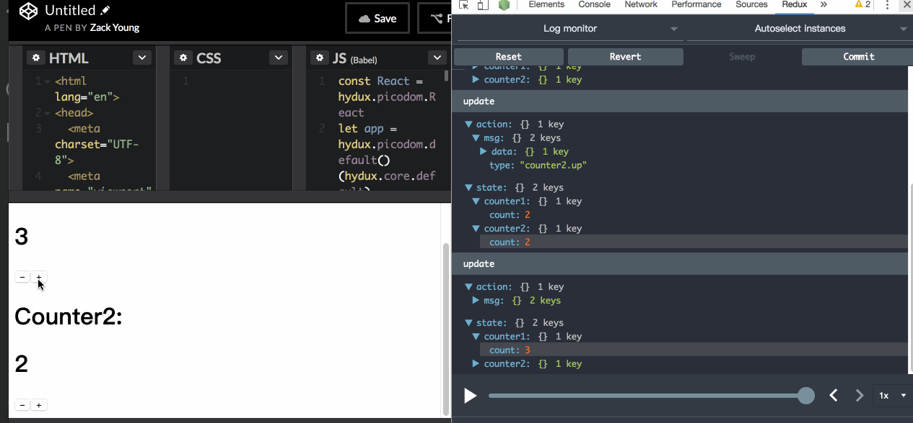

# Hydux

[](https://travis-ci.org/hydux/hydux) [](https://www.npmjs.com/package/hydux) [](https://www.npmjs.com/package/hydux)

A React-Compatible fork of [Hyperapp](https://github.com/hyperapp/hyperapp), inspired by [Elmish](https://github.com/fable-elmish/elmish), Elm, Redux, etc. Working with any vdom library!

## Features

* [hyperapp](https://github.com/hyperapp/hyperapp) compatible API
* Elm-like [side effect manager](https://github.com/hydux/hydux#actions-with-cmd) and subscribe API
* Support any vdom library, including react ([official support](https://github.com/hydux/hydux-react))
* [Router (**Recommended**)](https://github.com/hydux/hydux/tree/master/examples/router)
* [Official support for react-router](https://github.com/hydux/hydux-react-router)
* Hot reload (hmr)
* [Server-Side Rendering(SSR)](https://github.com/hydux/hydux/tree/master/docs/ssr.md)
* [code splitting](https://github.com/hydux/hydux/tree/master/examples/code-splitting), seamlessly integrated with SSR.
* logger, persist, [Redux Devtools with time traveling](https://github.com/zalmoxisus/redux-devtools-extension), [ultradom](https://github.com/jorgebucaran/ultradom)(1kb vdom), **\*\*All in One\*\***, easily setup all these fancy stuff without pain!



## [Try it online!](https://codepen.io/zaaack/pen/zPgodL)

## Install

```sh
yarn add hydux # or npm i hydux
```

## Quick Example

Let's say we got a counter, like this.

```js
// Counter.js
export default {
  init: () => ({ count: 1 }),
  actions: {
    down: () => state => ({ count: state.count - 1 }),
    up: () => state => ({ count: state.count + 1 })
  },
  view: (state: State, actions: Actions) =>
    <div>
      <h1>{state.count}</h1>
      <button onclick={actions.down}>–</button>
      <button onclick={actions.up}>+</button>
    </div>
}
```

Then we can compose it in Elm way, you can easily reuse your components.

```js
import _app from 'hydux'
import withPersist from 'hydux/lib/enhancers/persist'
import withUltradom, { h, React } from 'hydux/lib/enhancers/ultradom-render'
import Counter from './counter'

// let app = withPersist<State, Actions>({
//   key: 'my-counter-app/v1'
// })(_app)

// use built-in 1kb ultradom to render the view.
let app = withUltradom()(_app)

if (process.env.NODE_ENV === 'development') {
  // built-in dev tools, without pain.
  const devTools = require('hydux/lib/enhancers/devtools').default
  const logger = require('hydux/lib/enhancers/logger').default
  const hmr = require('hydux/lib/enhancers/hmr').default
  app = logger()(app)
  app = devTools()(app)
  app = hmr()(app)
}

const actions = {
  counter1: Counter.actions,
  counter2: Counter.actions,
}

const state = {
  counter1: Counter.init(),
  counter2: Counter.init(),
}

const view = (
  state: State,
  actions: Actions,
) =>
    <main>
      <h1>Counter1:</h1>
      {Counter.view(state.counter1, actions.counter1)}
      <h1>Counter2:</h1>
      {Counter.view(state.counter2, actions.counter2)}
    </main>

export default app({
  init: () => state,
  actions,
  view,
})
```

## Actions with Cmd

This library also implemented a Elm-like side effects manager, you can simple return a tuple (two elements array) in your action, and put the Cmd as the second element.
e.g.

```js
import app, { Cmd } from 'hydux'

function upLater(n) {
  return new Promise(resolve => setTimeout(() => resolve(n + 10), 1000))
}
app({
  init: () => ({ count: 1}),
  actions: {
    down: () => state => ({ count: state.count - 1 }),
    up: () => state => ({ count: state.count + 1 }),
    upN: n => state => ({ count: state.count + n }),
    upLater: n => (
      state,
      actions/* actions of same level */
    ) => [
      state, // don't change the state, won't trigger view update
      Cmd.ofPromise(
        upLater /* a function with single parameter and return a promise */,
        n /* the parameter of the funciton */,
        actions.upN /* success handler, optional */,
        console.error /* error handler, optional */ )
    ]
  },
  view: () => {/*...*/} ,
})
```

## Parent-Child Components Communication

In Elm, we can intercept child component's message in parent component, because child's update function is called in parent's update function. But how can we do this in hydux?

```js
import * as assert from 'assert'
import app, { Cmd, withParents, noop } from '../index'
import Counter from './counter'

const initState = {
  counter1: Counter.init(),
  counter2: Counter.init(),
}
const actions = {
  counter2: counter.actions,
  counter1: {
    ...counter.actions,
    upN: (
      n: number
    ) => withParents(
      counter.actions.upN,
      (
        action,
        parentState: State,
        parentActions: Actions,
      ) => {
        const [state, cmd] = action(n + 1)
        assert.equal(state.count, parentState.counter1.count + n + 1, 'call child action work')
        return [state, Cmd.batch(cmd, Cmd.ofFn(() => parentActions.counter2.up()))]
      }
    )
  },
}
type State = typeof initState
type Actions = typeof actions
let ctx = app<State, Actions>({
  init: () => initState,
  actions,
  view: noop,
  onRender: noop
})

```

## Documentation

* [API tutorial with examples](https://github.com/hydux/hydux/tree/master/docs/api.md)
* [Generated API Reference](https://hydux.github.io/hydux/api)
* [Server-Side Rendering(SSR) Tutorial](https://github.com/hydux/hydux/tree/master/docs/ssr.md)

## Ecosystem

### Libraries

* [hydux-react](https://github.com/hydux/hydux-react): Hydux's react integration
* [hydux-react-router](https://github.com/hydux/hydux-react-router): Hydux's react-router integration
* [hydux-mutator](https://github.com/hydux/hydux-mutator): A statically-typed immutable update help package, which also contains immutable collections.
* [hydux-transitions](https://github.com/hydux/hydux-transitions): A css transition library inspired by [animajs](http://animejs.com/)'s timeline, follow **The Elm Architecture**.
* [hydux-data](https://github.com/hydux/hydux-data): Statically-typed data-driven development for hydux, in the Elm way. Inspired by apollo-client.

### Samples

* [samples-antd](https://github.com/hydux/samples-antd): Admin sample in hydux.

## Counter App

```sh
git clone https://github.com/hydux/hydux.git
cd examples/counter
yarn # or npm i
npm start
```

Now open <http://localhost:8080> and hack!

## Why

After trying [Fable](https://fable.io) + [Elmish](https://github.com/fable-elmish/elmish) for several month, I need to write a small web App in my company, for many reasons I cannot choose some fancy stuff like [Fable](https://fable.io) + [Elmish](https://github.com/fable-elmish/elmish), simply speaking, I need to use the mainstream JS stack but don't want to bear Redux's cumbersome, complex toolchain, etc anymore.

After some digging around, hyperapp looks really good to me, but I quickly find out it doesn't work with React, and many libraries don't work with the newest API. So I create this to support ****different**** vdom libraries, like React([official support](https://github.io/hydux/hydux-react)), [ultradom](https://github.com/jorgebucaran/ultradom)([built-in](https://github.com/hydux/hydux/blob/master/src/enhancers/ultradom-render.ts)), Preact, [inferno](https://github.com/infernojs/inferno) or what ever you want, just need to write a simple enhancer!

Also, to avoid breaking change, we have ****built-in**** support for HMR, logger, persist, [Redux Devtools](https://github.com/zalmoxisus/redux-devtools-extension), you know you want it!

## License

MIT
